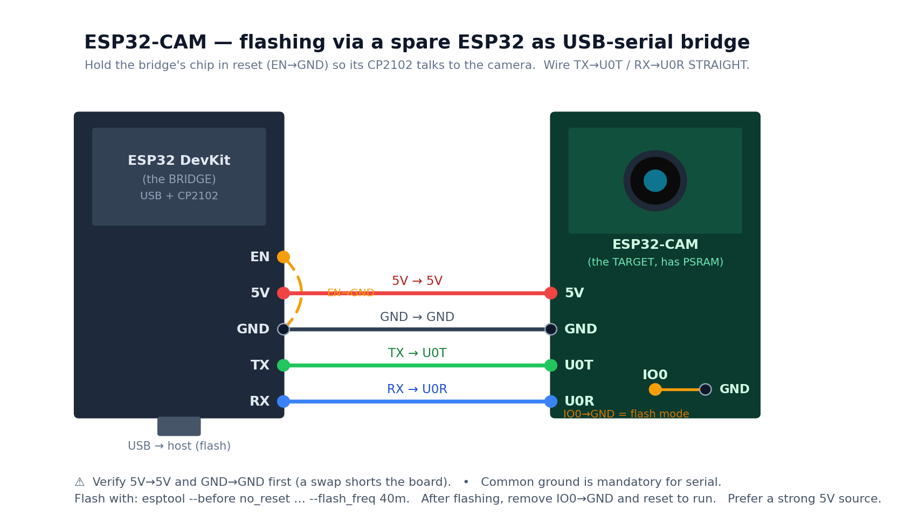

# Hardware

## The boards involved

| Board | USB | USB-serial chip | PSRAM | Role |
|-------|-----|-----------------|-------|------|
| **AI-Thinker ESP32-CAM** | none | none | yes (`PSRAM64H`) | the camera (target) |
| **ESP32-CAM-MB shield** | micro-USB | CH340 | — | programmer/power base for the cam |
| **Generic ESP32 DevKit** (NodeMCU-32S / USB-C) | micro-USB / USB-C | CP2102 / CH340 | usually none | can act as a USB-serial **bridge** |

Key facts that trip people up:

- The **ESP32-CAM has no USB port of its own.** It is flashed over UART through an
  external USB-serial chip — either the MB shield or a USB-TTL adapter.
- The original **ESP32 (D0WD) has no native USB**, so there is *no* DFU/UF2 fallback.
  A working serial bridge is mandatory to flash it.
- The camera streams over **WiFi**, completely independent of USB. USB is only for
  flashing and (optionally) reading serial. Once flashed, the cam just needs **power**.

## Powering the cam

The camera is power-hungry in bursts — the sensor and especially the **WiFi radio
draw current spikes** that can dip the supply. Power it from a source that can
deliver them:

- ✅ **MB shield** (its CH340 may be dead but its 5V regulator is fine)
- ✅ A real **5V USB charger / power bank**
- ✅ A bench/breadboard **power-supply module** (set to 5V)
- ⚠️ A dev board's `5V` pin / weak USB-bus power — **works only with the firmware
  power-hardening** in this repo (brownout detector disabled, low cam clock, reduced
  WiFi TX power). Even then it's marginal.

Feed **5V → cam `5V`** (the cam has its own onboard 3.3 V regulator). Always share a
common ground.

## When the MB shield's serial chip is dead

A very common failure: the MB shield powers the cam (red LED on) but **never
enumerates as a serial port** — no `/dev/cu.*`, nothing in the USB device tree, no
log events. That's a dead/abandoned **CH340**. Confirm it with the bare shield (no
cam) + a *known-data* cable; if still nothing, the chip is gone.

You don't need to buy anything if you have a **spare ESP32 dev board** — use it as a
USB-serial bridge.

## Using a spare ESP32 as a USB-serial bridge

The trick: **hold the bridge board's own ESP32 in reset** (tie its `EN` pin to `GND`)
so its CP2102 is freed up, then tap that CP2102's UART lines onto the camera.

### Wiring: bridge → ESP32-CAM

| Bridge ESP32 (CP2102) | ESP32-CAM | Notes |
|-----------------------|-----------|-------|
| `EN` → `GND` *(on the bridge itself)* | — | disables the bridge's chip |
| `GND` | `GND` | **common ground is mandatory** |
| `5V` *(or external 5V)* | `5V` | power — prefer a strong source |
| `TX` | `U0T` | **straight, not crossed** (see below) |
| `RX` | `U0R` | **straight, not crossed** |
| — | `IO0` → `GND` | jumper = enter flash mode |

> **Why TX→U0T / RX→U0R are *straight*, not crossed:** the bridge's `TX`/`RX` labels
> are from *its ESP32's* point of view. With that ESP32 held in reset, you're really
> tapping the CP2102 on the far side of those pins — so the usual cross is already
> baked in. Wire them straight.

### Flash-mode vs run-mode

- **`IO0` → `GND` at power-up** → bootloader / download mode (for flashing).
- **`IO0` floating** → normal boot, runs the firmware.

Because the bridge's auto-reset (DTR/RTS) can't reach the *cam's* `EN`/`IO0`, put the
cam into download mode **manually**: jumper `IO0→GND`, then power-cycle or tap the
cam's `RST`. Flash with `esptool --before no_reset`. After flashing, remove the
`IO0` jumper and reset to run.

## Cables — the silent time-sink

Many USB cables are **charge-only** (power wires only, no data). Symptoms:
power LED lights, but the device **never enumerates** and the host logs **zero USB
events**. We burned a lot of time here. Always verify with a cable you've actually
moved files over, and prefer a direct host port over hubs while debugging.
